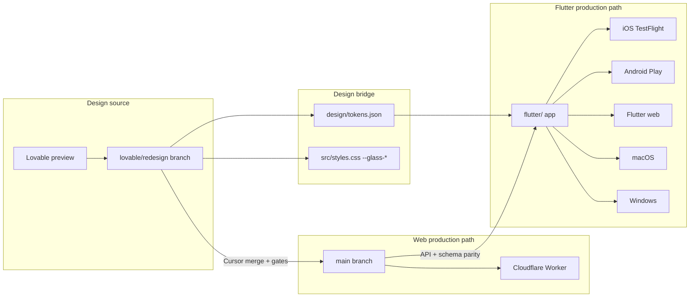

# Lovable design source, Cursor Flutter implementer

This runbook defines how Purple ships a **Flutter multi-platform app** while
Lovable continues to own visual design on the TanStack web redesign branch.
GitHub `main` gatekeeps web production; Flutter lives under `flutter/` and
tracks design through a shared token file, not by copying React components.

Related docs:

- Web redesign gatekeeper: [`LOVABLE-REDESIGN-WORKFLOW.md`](LOVABLE-REDESIGN-WORKFLOW.md)
- Web sync architecture: [`SYNC-AND-RELEASE.md`](SYNC-AND-RELEASE.md)
- Durable decision: [`mem/flutter-lovable-workflow.md`](../mem/flutter-lovable-workflow.md)
- Flutter build commands: [`flutter/README.md`](../flutter/README.md)
- Capacitor shell (current native track): [`native-app-setup.md`](native-app-setup.md)

## Architecture

Lovable designs on `lovable/redesign` (TanStack Start + Tailwind). Cursor
extracts **design tokens and screen specs** from that branch, updates
`design/tokens.json`, and ports screens into Flutter. Backend, auth, RLS, and
API contracts stay shared with the web app (Supabase + Cloudflare Worker).



### Token bridge

| Source | Target | Owner |
|--------|--------|-------|
| Tailwind semantic colors, spacing, radii in Lovable UI | `design/tokens.json` | Cursor after each Lovable merge |
| Liquid glass values in `src/styles.css` (`--glass-*`) | `design/tokens.json` → `ThemeExtension` in Flutter | Cursor |
| i18n keys in `src/i18n/locales/en.json` | Flutter ARB files under `flutter/lib/l10n/` | Cursor when strings change |
| Route map in `docs/FEATURES.md` | Flutter `GoRouter` routes | Cursor |

`design/tokens.json` is the **single cross-platform design contract**. Lovable
does not edit it. Cursor regenerates or patches it when Lovable lands layout or
theme changes on `lovable/redesign` or `main`.

## Sync loop after each Lovable push

Run this whenever the user says Lovable pushed, or after merging
`lovable/redesign` into `main`.

### 1. Discover web changes

```bash
git fetch origin
git log HEAD..origin/lovable/redesign --oneline
git diff HEAD..origin/lovable/redesign --stat
```

Focus on: new or changed routes under `src/routes/`, theme tokens in
`src/styles.css`, shared UI in `src/components/`, i18n diffs.

### 2. Gate the web branch (required before token export)

Follow [`LOVABLE-REDESIGN-WORKFLOW.md`](LOVABLE-REDESIGN-WORKFLOW.md):

```bash
bun run check:em-dash
bun run check:live-data
bun run check:unique-images
bun run check:lovable-auth
bunx tsc --noEmit
bun run build:prod
bun run check:entry-budget
```

If migrations changed, verify schema against live DB before trusting UI.

### 3. Update `design/tokens.json`

Extract from the merged web sources:

- Semantic colors (`foreground`, `background`, `card`, `primary`, `muted`, etc.)
- Spacing scale used on app pages (`max-w-3xl` column, sheet `max-w-xl`)
- Border radii, typography sizes, elevation/shadows
- Liquid glass approximations from `mem/design/liquid-glass-tokens.md`

Commit token changes in the same PR as Flutter screen ports when possible.

### 4. Port affected Flutter screens

For each changed web route, map to a Flutter screen under `flutter/lib/`.
Match layout intent (centered column, capped sheets, 44pt targets), not
pixel-perfect DOM copy. Reuse widgets in `flutter/lib/design/`.

### 5. Verify Flutter

```bash
cd flutter
flutter analyze
flutter test
flutter build apk --debug          # Android smoke
flutter build ios --no-codesign    # iOS compile smoke (macOS only)
flutter build web                  # web smoke
```

Visual check: compare Lovable preview screenshots to Flutter simulators at
375px and 1024px widths.

### 6. Document and hand off

Update `CURSOR_HANDOFF.md`, this file if the loop changed, and
`mem/flutter-lovable-workflow.md` for durable decisions.

## Paste-ready Cursor agent prompt (port a screen)

Copy into a new Cursor agent task after a Lovable merge lists changed routes.

```
Context: Purple Flutter app under flutter/. Web design source is branch
lovable/redesign (TanStack + Tailwind). Shared tokens: design/tokens.json.
Runbook: docs/LOVABLE-FLUTTER-SYNC.md.

Task: Port the web route <ROUTE_PATH> to Flutter.

Steps:
1. Read the web implementation: src/routes/<WEB_FILE> and shared components it imports.
2. Read design/tokens.json and mem/design/liquid-glass-tokens.md for theme values.
3. Read docs/FEATURES.md for expected behavior and empty states (no fake health data).
4. Implement or update flutter/lib/features/<feature>/ with matching navigation, i18n, and offline-first reads where applicable.
5. Use existing flutter/lib/design/ widgets; do not hand-roll primitives that already exist.
6. Wire Supabase through flutter/lib/core/supabase/ (same project ref as web, env from Doppler locally, never commit secrets).
7. Run: cd flutter && flutter analyze && flutter test.
8. Do not change web src/ unless fixing a shared API contract bug.
9. Sync CURSOR_HANDOFF.md with what you ported and how to verify.

Constraints: no em dashes in user-facing strings. Center content in a capped column (Apple-grade layout). Cross-user access returns 404 pattern on API, not 403. HIPAA empty states when no real biometrics.
```

Replace `<ROUTE_PATH>` and `<WEB_FILE>` per screen.

## Platform deploy matrix

Flutter is the long-term multi-platform client. Capacitor (WebView loading
`www.purplelife.org`) remains the current TestFlight path until Flutter reaches
parity per phase rollout below.

| Platform | Phase 0 | Build / ship path | Notes |
|----------|---------|-------------------|-------|
| **iOS** | Scaffold + local run | `flutter run -d ios` → TestFlight via Xcode archive or CI | Reuse bundle `org.purplelife.app` when replacing Capacitor; HealthKit via platform channels |
| **Android** | Scaffold + local run | `flutter run -d android` → Play internal track | Health Connect via platform channels; same Supabase auth |
| **Web** | Scaffold + local run | `flutter build web` → optional Worker static route or separate host | Does not replace TanStack marketing SSR until Phase 5 decision |
| **macOS** | Scaffold + local run | `flutter run -d macos` → notarized DMG later | Desktop shell for journal review |
| **Windows** | Scaffold + local run | `flutter run -d windows` → MSIX later | Caregiver desktop use case |

### iOS TestFlight (Flutter, when ready)

1. Apple Developer team and ASC app record (see [`testflight-setup.md`](testflight-setup.md)).
2. Signing via Xcode or CI with Doppler `purple-life` / `prd` (`DEVELOPMENT_TEAM`, `APP_STORE_CONNECT_*`).
3. `cd flutter && flutter build ipa --export-options-plist=ios/ExportOptions.plist` (add plist in Phase 1+).
4. Upload with `xcrun altool` or App Store Connect API (same Doppler keys as Capacitor pipeline).

### Android internal track

1. Play Console app linked to `org.purplelife.app` (or `org.purplelife.app.flutter` during beta).
2. `flutter build appbundle --release`.
3. Upload to internal testing; wire FCM when push ships (Phase 4).

### Web

Phase 0: local `flutter run -d chrome`. Production hosting decision in Phase 5
(subpath on `www.purplelife.org`, subdomain, or app-only).

## Offline-first requirements

Health journal data is sensitive and often read on poor networks. Flutter must
meet these bars before a screen is considered done:

| Requirement | Implementation |
|-------------|----------------|
| Read offline | Cache last-known Supabase rows locally (Drift/Hive/isar per Phase 0 choice) |
| Write offline | Queue mutations with idempotency keys; replay when online |
| Auth session | Persist refresh token securely (`flutter_secure_storage`) |
| Sync status | Surface "offline" and last sync time like web `NativeConnectivityGate` |
| Conflict policy | Server wins for care-shared data; last-write-wins for own journal drafts with audit |
| No fake vitals | Empty states and connect prompts only; same rule as `check-no-fake-vitals.mjs` |
| Migrations | Local schema version must match remote; block app if migration required |

Web TanStack app uses online-first with PWA shell; Flutter is **offline-first by
default** for signed-in app routes.

## What Lovable owns vs Cursor owns

| Area | Lovable | Cursor |
|------|---------|--------|
| Visual design, marketing pages, app screen layout on web | Yes | Review only |
| `lovable/redesign` pushes | Yes | Merge to `main` after gates |
| `design/tokens.json` | No | Yes, after each design merge |
| `flutter/` Dart code | No | Yes |
| `src/integrations/supabase/types.ts` | No | Yes |
| SQL migrations, RLS, edge functions | No | Yes |
| Cloudflare Worker, cron, webhooks | No | Yes |
| Capacitor `ios/` / `android/` (interim) | No | Yes |
| Paste-ready Lovable prompts for pure UI fixes on web | No | Yes |
| Flutter widget library (`design/`) | No | Yes |
| i18n source of truth | Web JSON first | Flutter ARB synced from web |
| Production deploy web | No | Yes, with owner approval |
| Production deploy Flutter stores | No | Yes, with owner approval |

Lovable must never edit `flutter/`, `design/tokens.json`, or `types.ts`. See
[`LOVABLE-DESIGNER-RULES.md`](LOVABLE-DESIGNER-RULES.md).

## Phase rollout 0–5

| Phase | Goal | Exit criteria |
|-------|------|---------------|
| **0** | Foundation | `flutter/` project, `design/tokens.json`, docs, CI analyze/test, empty shell app runs on iOS/Android/web/macOS/Windows |
| **1** | Auth + shell | Sign in/up, session restore, bottom nav, theme from tokens, GoRouter map of top-level routes |
| **2** | Core health home | Today, vitals, my-health with real Supabase reads, HIPAA empty states, pull-to-refresh sync |
| **3** | Journal + meds + settings | Feature parity with web app routes; local notifications for dose reminders |
| **4** | Native integrations | HealthKit, Health Connect, wearables OAuth, offline queue, push (APNs/FCM) |
| **5** | Store parity + cutover | TestFlight/Play beta, optional Flutter web; owner decision on Capacitor retirement vs dual ship |

Phase 0 runs as **six parallel Cursor agents** (scaffold, tokens, Supabase
client, design system, CI, documentation). This document is Agent 6/6.

## Phase 1 status (complete, 2026-07-04)

Phase 1 agents (A/B/C feature ports + Agent F integration) merged into `flutter/`:

| Area | Status | Notes |
|------|--------|-------|
| Auth + session | Done | Email/password, Google/Apple OAuth hooks, `authRedirect` → `/today`, secure session |
| Shell | Done | `NativeAppShell`, glass bottom nav, top bar, `OfflineBanner` on all tabbed routes |
| GoRouter map | Done | Sign-in, Today, Vitals, Journal (+ capture), Meds, Settings hub + sub-routes, Account, Tools, Care dashboard, Chat stubs |
| Loading polish | Done | `LoadingSkeleton` on Today, Vitals, Journal, Meds, Care dashboard async providers |
| Offline UX | Done | Global `OfflineBanner` in shell; per-screen offline badges where data providers expose `isOffline` |
| Codegen | Done | `dart run build_runner build --delete-conflicting-outputs` (Drift) |

**Verify Phase 1:**

```bash
cd flutter
flutter pub get
dart run build_runner build --delete-conflicting-outputs
flutter analyze lib/    # zero issues
flutter test            # 3 tests pass
```

**Screen map (functional vs stub):**

| Route | Screen | Phase 1 |
|-------|--------|---------|
| `/sign-in` | SignInScreen | Functional |
| `/today` | TodayScreen | Functional (Supabase reads, empty states) |
| `/vitals` | VitalsScreen | Functional |
| `/journal` | JournalScreen | Functional |
| `/journal/new` | JournalCaptureScreen | Functional (offline queue save) |
| `/meds` | MedsScreen | Functional |
| `/settings` | SettingsScreen | Functional (hub navigation) |
| `/account` | AccountScreen | Functional (profile read, sign out); some rows stub |
| `/tools` | ToolsScreen | Partial (UI + Apple Health panel; OAuth connect stub) |
| `/care/:ownerId` | CareDashboardScreen | Functional (scoped tabs, loading) |
| `/settings/sharing` | SharingScreen | Stub |
| `/settings/travel`, `/reports`, `/contact` | SettingsPlaceholderScreen | Stub |
| `/chat`, `/chat-care` | ChatScreen, ChatCareScreen | Stub (routes wired, full UI Phase 3+) |

Phase 2 next: deepen Today/Vitals/my-health Supabase parity, pull-to-refresh sync, HIPAA empty states audit.

## Verification checklist (Phase 0)

```bash
# Web gates still required when Lovable merges
bun run check:em-dash && bun run build:prod

# Flutter foundation
cd flutter && flutter doctor && flutter analyze && flutter test

# Token file present
test -f design/tokens.json && echo "tokens ok"
```

## Improvement backlog

- Automate `design/tokens.json` extraction from `src/styles.css` and Tailwind config.
- Add Playwright-style golden screenshots for Flutter (`integration_test/`).
- CI job: `flutter analyze` on pushes touching `flutter/` or `design/tokens.json`.
- Document Flutter env parity (mirror [`LOVABLE-ENV-PARITY.md`](LOVABLE-ENV-PARITY.md) for mobile).
