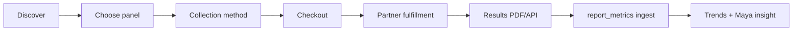

# Lab ordering — implementation spec

**Status:** Preview + spec only. No production Stripe or lab-partner integration without explicit owner approval.

**Preview:** `docs/previews/personalized-dashboard-preview.html` — Recommended tab hero + 3-step order modal; Data tab empty state when "Labs uploaded" is unchecked. Serve: `./scripts/preview-design-serve.sh` → http://127.0.0.1:8766/personalized-dashboard-preview.html

**Gap matrix:** `docs/previews/SUPERPOWER-PURPLE-FEATURE-MATRIX.md`

---

## What exists today (audit summary)

| Area | Status | Notes |
|---|---|---|
| Report upload (PDF/image) | **Exists** | `/reports/new`, `processReport`, storage + AI extraction |
| `report_metrics` ingest | **Exists** | Parsed lab values with `flag`, `reference_low/high`, trends at `/reports/trends/$metricKey` |
| `report_documents` / `medical_reports` | **Exists** | RLS-scoped; caregiver read via care scopes |
| Wearable integrations | **Exists** | Oura, Whoop, Apple Health on `/tools` |
| Stripe subscription billing | **Exists** | Pro monthly/yearly via `billing.functions.ts`; **no lab SKUs** |
| `FEATURE_CATALOG` / condition traits | **Exists** | Tracker toggles; no `order_labs` feature key yet |
| Recommended / marketplace UI | **Preview only** | HTML mock; production **net-new** |
| Lab order tables (`lab_orders`) | **Net-new** | No migration or API |
| Quest / Labcorp partner API | **Net-new** | Mentioned in AI prompts only (e.g. "Quest CBC + lipids" title) |
| In-app lab checkout | **Net-new** | Stripe placeholder in preview; no `STRIPE_PRICE_LAB_*` env vars |

---

## User journey (target)



1. **Discover** — Recommended tab, Data empty state, or Maya prompt ("You have no recent labs — consider ordering a panel").
2. **Choose panel** — Ranked from `profiles.conditions` + traits (`seizure_prone`, `cardiovascular`, `sleep_critical`). Mock panels in preview; prod uses `lab_panel_catalog` or partner SKU map.
3. **Collection** — Partner draw site (Quest/Labcorp) or at-home kit (partner fulfillment). Phase 1 may deep-link to partner concierge URL instead of in-app location picker.
4. **Checkout** — Stripe Payment Link or Checkout Session (Phase 2). Licensed provider review step is partner-side or manual concierge.
5. **Fulfillment** — Partner sends draw kit or schedules visit; status webhooks update `lab_orders.status`.
6. **Results** — PDF or HL7/FHIR payload → existing `processReport` pipeline → `report_metrics` rows linked to `lab_order_id`.
7. **Insights** — Existing `/reports/trends`, Maya metric insight, Today protocol cards reference new flags.

---

## Phase 1 (MVP) vs Phase 2 (in-app)

### Phase 1 — Concierge / deep link (recommended first ship)

| Piece | Approach |
|---|---|
| Discovery UI | Recommended hero + Data empty CTA (preview patterns) |
| Panel list | Static catalog in code or CMS; Maya copy only, no regulated claims |
| Checkout | **No in-app payment** — CTA opens partner URL, Typeform, or email concierge |
| Order tracking | Optional `lab_orders` row with `status=requested` + manual ops update |
| Results | User uploads PDF **or** ops attaches results → existing extraction |
| Time to ship | Weeks (UI + legal copy + partner landing page) |

**Why Phase 1:** No lab partner contract, no Stripe lab SKUs, no CLIA/provider compliance in Purple's Worker yet. Matches "preview only until approval" gate.

### Phase 2 — In-app Stripe + partner API

| Piece | Approach |
|---|---|
| Checkout | Stripe Checkout Session or Payment Links per panel SKU |
| Location | Quest/Labcorp location API or embedded partner widget |
| Webhooks | Stripe `checkout.session.completed` + partner status → update `lab_orders` |
| Auto-ingest | Partner results webhook → `report_documents` + `report_metrics` without manual upload |
| Time to ship | Months (partner agreement, SKUs, legal, webhook reliability) |

---

## Backend options

### Stripe

| Option | Pros | Cons |
|---|---|---|
| **Payment Links** | Fast ops setup, no custom checkout UI | Harder to attach `user_id` metadata without redirect handling |
| **Checkout Sessions** | Already used for Pro (`createCheckoutSession`); rich metadata | Needs new Price IDs per panel in Doppler |
| **Connect / partner split** | If lab vendor is merchant of record | Heavy compliance; likely partner bills directly in Phase 1 |

**Current repo:** `STRIPE_PRICE_MONTHLY`, `STRIPE_PRICE_YEARLY` only. Lab products require new Prices + webhook handler extension in `src/routes/api/public/stripe-webhook.ts`.

### Lab partners (Quest, Labcorp, others)

- **Phase 1:** Manual — partner referral link, concierge email, or white-label reseller (e.g. Function Health-style aggregator). Purple stores intent in `lab_orders`, not fulfillment.
- **Phase 2:** API integration (location search, order create, status, results). Typically requires B2B agreement, provider NPI, and US state lab regulations.
- **Do not** claim FDA-cleared test kits or specific analyte lists in marketing until partner provides approved copy.

---

## Schema sketch (net-new)

```sql
-- lab_orders: one checkout or concierge request per user
create table lab_orders (
  id uuid primary key default gen_random_uuid(),
  user_id uuid not null references auth.users(id) on delete cascade,
  status text not null default 'draft'
    check (status in ('draft','pending_payment','paid','requested','scheduled','collected','processing','completed','cancelled','failed')),
  panel_key text not null,
  collection_method text check (collection_method in ('partner_lab','at_home_kit')),
  partner text, -- 'quest', 'labcorp', 'concierge', etc.
  partner_order_id text,
  stripe_checkout_session_id text,
  stripe_payment_intent_id text,
  total_cents int,
  currency text default 'usd',
  provider_review_status text,
  scheduled_at timestamptz,
  completed_at timestamptz,
  report_document_id uuid references report_documents(id),
  metadata jsonb default '{}',
  created_at timestamptz not null default now(),
  updated_at timestamptz not null default now()
);

-- lab_order_items: line items if bundles split
create table lab_order_items (
  id uuid primary key default gen_random_uuid(),
  lab_order_id uuid not null references lab_orders(id) on delete cascade,
  sku text not null,
  display_name text not null,
  quantity int not null default 1,
  unit_cents int,
  created_at timestamptz not null default now()
);

alter table lab_orders enable row level security;
alter table lab_order_items enable row level security;

create policy "Users read own lab orders"
  on lab_orders for select using (auth.uid() = user_id);
create policy "Users insert own lab orders"
  on lab_orders for insert with check (auth.uid() = user_id);
-- Updates: service role + partner webhooks only (no user UPDATE on payment fields)

create policy "Users read own lab order items"
  on lab_order_items for select
  using (exists (
    select 1 from lab_orders o
    where o.id = lab_order_id and o.user_id = auth.uid()
  ));
```

Optional: `lab_panel_catalog` (panel_key, display_name, trait_weights, stripe_price_id, partner_sku, active, us_only).

Link extraction: add nullable `lab_order_id` on `report_documents` when results arrive from a known order.

---

## Maya personalization

- **Input:** `profiles.conditions`, `traitsForConditions`, recent `biometrics` gaps, `report_metrics` staleness (no labs in 12 months).
- **Output:** Ranked panel recommendations + hero copy (preview: `labRecommendationReason()`).
- **API:** Extend `/api/ai/daily-insight-cards` or new `/api/ai/lab-recommendations` (read-only, no auto-order).
- **Guardrails:** No diagnosis; "discuss with your clinician"; no fake prices; epilepsy panel uses mock name only until partner approves analyte list.

---

## Disclaimers (required in prod UI)

- Purple is **not** a medical provider; lab ordering requires a **licensed clinician** (partner or concierge).
- Information is **not medical advice**; results must be reviewed with the user's care team.
- **US-only** for Phase 1 unless partner supports other regions.
- No guarantee of insurance coverage; price shown at Stripe checkout when configured.
- HIPAA: lab orders are PHI; same RLS and audit patterns as `report_documents` (`phi_access_log` on caregiver read).

---

## Routes / surfaces (production, post-approval)

| Surface | Route | Notes |
|---|---|---|
| Order entry | `/labs/order` or Recommended section on Today | TanStack + Flutter parity |
| Order history | `/labs/orders` | List `lab_orders` |
| Tools | Optional card on `/tools` | Alongside wearables, not mixed with device picker |
| Data empty state | `/biometrics` or unified Data tab | CTA when `report_metrics` count = 0 |
| Webhook | `/api/public/webhooks/lab-partner` | Partner-specific secret |
| Stripe | Extend existing webhook | New `metadata.type = lab_order` |

---

## Owner decisions (blockers)

| Decision | Options | Impact |
|---|---|---|
| **Lab partner** | Quest direct, Labcorp, aggregator (e.g. Junction, Health Gorilla), concierge-only | API design, legal, fulfillment |
| **Stripe SKUs** | Per-panel Prices vs single "lab credit" | Checkout UX, refunds |
| **Provider of record** | Partner clinician vs Purple telehealth vendor | Compliance, state licenses |
| **Phase 1 CTA** | External URL vs in-app form vs email ops | Engineering scope |
| **At-home vs draw site** | Kit SKU availability by state | Collection step UI |
| **Results ingest** | Manual upload only vs partner webhook | `report_metrics` automation |
| **Legal review** | Required before any paid lab flow | Copy, disclaimers, privacy policy |

---

## Verification (preview)

```bash
./scripts/preview-design-serve.sh
curl -s -o /dev/null -w '%{http_code}\n' http://127.0.0.1:8766/personalized-dashboard-preview.html
```

Manual: open Recommended tab → "Order a blood panel" hero → 3-step modal → Stripe placeholder. Uncheck "Labs uploaded" → Data tab empty state → "Order a panel". Toggle dark/light and sleep+heart focus.

---

## MVP recommendation

**Ship Phase 1 first:** Recommended + Data CTAs, static panel catalog, concierge/deep-link handoff, optional `lab_orders` status tracking, results via existing upload pipeline. Defer Stripe lab checkout and partner APIs to Phase 2 after partner + legal sign-off.
